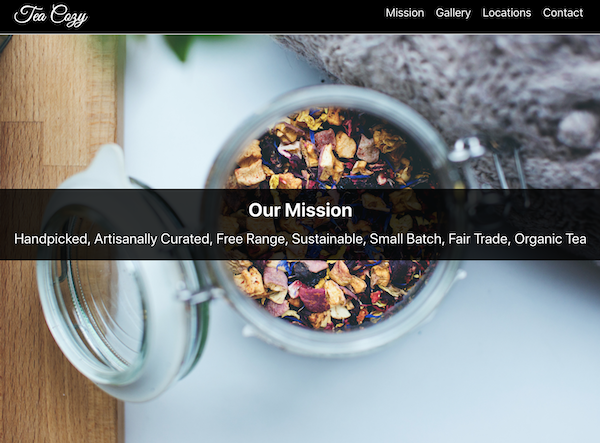

# Tea Cozy


## Introduction
[ IN PROGRESS ]
- This project was originally created as part of the Codecademy Web Development Path using only HTML and CSS.
- The goal here was recreate the project using React and including additional functionalities.

## Stack

- This project uses: 
  - App: [React](https://reactjs.org/)
  - Styling: [Styled Components](https://www.styled-components.com/)
  - Animation on scroll: [React Animate on Scroll](https://github.com/dbramwell/react-animate-on-scroll)

## Installation and Use

- Download the files, cd into root directory and run:
```bash
# Install dependencies
$ npm install

# Run the app
$ npm start
```

## References

- [MDN Web Docs](https://developer.mozilla.org/en-US/)
- [Styled Components](https://www.styled-components.com/)
- [React Animate on Scroll](https://github.com/dbramwell/react-animate-on-scroll)
- This project was bootstrapped with [Create React App](https://github.com/facebook/create-react-app).
- [React documentation](https://reactjs.org/).
- Deployed by following the [Oluwaseun Tutorial](https://medium.com/the-andela-way/how-to-deploy-your-react-application-to-github-pages-in-less-than-5-minutes-8c5f665a2d2a).

